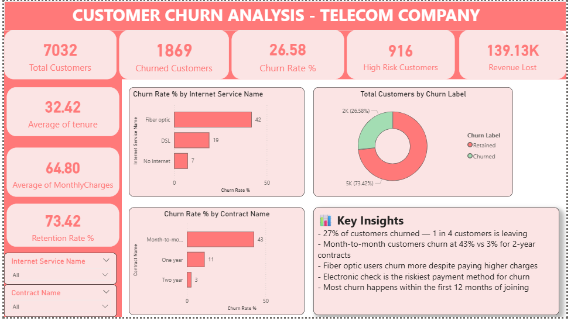
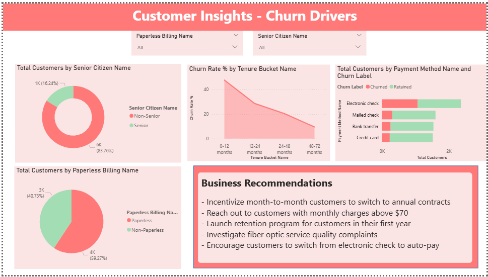

# Telecom Customer Churn Analysis

## Overview
End-to-end customer churn analysis on a telecom dataset of 7,000+ records.

## Tools Used
- Python (Pandas, Scikit-learn, Matplotlib, Seaborn)
- Power BI

## Key Findings
- 27% churn rate — 1 in 4 customers leaving
- Revenue lost to churn: $139K/month
- 916 high risk customers identified
- Month-to-month contracts have 43% churn rate

## Files
- `churn_analysis.ipynb` — Full Python analysis
- `churn_dashboard.pbix` — Power BI dashboard
- `dashboard_page1.png` — Dashboard overview
- `dashboard_page2.png` — Customer insights

- ## Dashboard Preview

### Page 1 - Churn Overview

### Page 2 - Customer Insights

